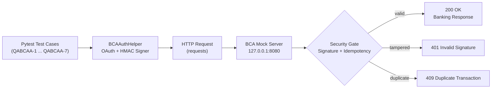

# 🏦 BCA Open Banking - API QA Automation & Security Testing Suite


An enterprise-grade Backend API Quality Assurance and automated test suite targeting **Bank Central Asia (BCA) Open Banking API Architecture** and **Standar Nasional Open API Pembayaran (SNAP BI)**.

The suite ships with a **self-contained Core Banking Mock Server**, so every test can run locally without sandbox credentials, VPN, or internet access.

---

## 📑 Table of Contents
- [Key Highlights](#-key-highlights)
- [Architecture](#-architecture)
- [Project Structure](#-project-structure)
- [Jira Requirements Traceability Matrix (RTM)](#-jira-requirements-traceability-matrix-rtm)
- [Security Implementation (HMAC-SHA256)](#-security-implementation-hmac-sha256)
- [Mock Server Endpoints](#-mock-server-endpoints)
- [Bug Reports](#-bug-reports)
- [How to Run the Tests](#-how-to-run-the-tests)
- [Test Execution Result](#-test-execution-result)
- [Author](#-author)

---

## ✨ Key Highlights
- 🔐 **OAuth 2.0 Client Credentials** flow with Basic Auth (`Base64(client_id:client_secret)`).
- ✍️ **HMAC-SHA256 request signing** following the BCA API V3 / SNAP BI signature specification.
- 🕒 **WIB (UTC+7) ISO-8601 timestamps** as required by BCA headers.
- 💸 Coverage for **Balance Inquiry, Account Statement, Intra-bank Transfer, and Virtual Account** flows.
- 🛡️ **Negative security testing**: tampered signature rejection & replay-attack / idempotency protection.
- 🧪 **Embedded mock core banking server** (`http.server`) auto-started by each test — zero external dependencies.
- 📊 **Pytest + HTML reporting** ready for CI pipelines.

---

## 🏗 Architecture



**Token chaining:** `QABCAA-1` stores the issued bearer token in `bca_active_token.txt`, which is reused by the subsequent tests (balance, statement, transfer, VA). If the file is missing, a default sandbox token is used.

---

## 📁 Project Structure

```
qa-bca-open-banking-api-automation/
├── bca_auth_helper.py                          # OAuth Basic Auth, body hash, HMAC-SHA256 signer, header builder
├── bca_mock_server.py                          # Core banking simulator (SNAP BI & API V3 endpoints)
├── bca_active_token.txt                        # Bearer token shared across test cases
├── requirements.txt                            # Python dependencies
├── test_QABCAA1_oauth_token.py                  # OAuth 2.0 token generation
├── test_QABCAA2_balance_inquiry.py              # Balance inquiry
├── test_QABCAA3_account_statement.py            # Account statement / mutation history
├── test_QABCAA4_fund_transfer_intra.py          # Intra-bank fund transfer
├── test_QABCAA5_virtual_account_payment.py      # VA inquiry & payment settlement
├── test_QABCAA6_bug_tampered_signature.py       # Security: tampered HMAC signature
└── test_QABCAA7_bug_replay_duplicate_transfer.py  # Security: replay attack / idempotency
```

---

## 📌 Jira Requirements Traceability Matrix (RTM)

| Jira ID | Banking Module | Test Scenario & Summary | Issue Type | Test Script |
| :--- | :--- | :--- | :--- | :--- |
| **QABCAA-1** | OAuth 2.0 Security | Verify successful B2B client credentials authorization and bearer token generation | `Task` | `test_QABCAA1_oauth_token.py` |
| **QABCAA-2** | Balance Inquiry | Verify customer ledger and available balance inquiry with valid HMAC signature | `Task` | `test_QABCAA2_balance_inquiry.py` |
| **QABCAA-3** | Account Statement | Verify historical transaction history and statement retrieval by date range | `Task` | `test_QABCAA3_account_statement.py` |
| **QABCAA-4** | Fund Transfer | Verify intra-bank transfer execution between BCA accounts with unique idempotency key | `Task` | `test_QABCAA4_fund_transfer_intra.py` |
| **QABCAA-5** | Virtual Account | Verify end-to-end inquiry and bill payment settlement for BCA Virtual Account | `Task` | `test_QABCAA5_virtual_account_payment.py` |
| **QABCAA-6** | Cryptographic Security | API endpoint fails to reject request when HMAC-SHA256 signature is manipulated | `Bug` 🔴 | `test_QABCAA6_bug_tampered_signature.py` |
| **QABCAA-7** | Financial Idempotency | System processes duplicate transfer request with identical Transaction ID (Replay Attack) | `Bug` 🔴 | `test_QABCAA7_bug_replay_duplicate_transfer.py` |

---

## 🔐 Security Implementation (HMAC-SHA256)

Implemented in [`bca_auth_helper.py`](bca_auth_helper.py):

```text
BodyHash     = Lowercase(HexEncode(SHA256(Minify(RequestBody))))
StringToSign = HTTPMethod + ":" + RelativePath + ":" + AccessToken + ":" + BodyHash + ":" + Timestamp
Signature    = Base64(HMAC-SHA256(StringToSign, ClientSecret))
```

**Mandatory request headers:**

| Header | Example / Description |
| :--- | :--- |
| `Authorization` | `Bearer <access_token>` |
| `Content-Type` | `application/json` |
| `X-BCA-Key` | API Key issued to the corporate client |
| `X-BCA-Timestamp` | `2026-10-05T10:15:30.000+07:00` (WIB, ISO-8601) |
| `X-BCA-Signature` | Base64 HMAC-SHA256 signature |

---

## 🌐 Mock Server Endpoints

Served by [`bca_mock_server.py`](bca_mock_server.py) on `http://127.0.0.1:8080`:

| Method | Endpoint | Purpose | Success | Error Cases |
| :--- | :--- | :--- | :--- | :--- |
| `POST` | `/api/oauth/token` | OAuth 2.0 token issuance | `200` | `401 ERR-BCA-INVALID-CLIENT` |
| `GET` | `/banking/v3/corporates/{CorpID}/accounts/{AccNo}/balance` | Balance inquiry | `200` | — |
| `GET` | `/banking/v3/corporates/{CorpID}/accounts/{AccNo}/statements` | Account statement | `200` | — |
| `POST` | `/banking/v3/corporates/{CorpID}/transfers` | Intra-bank transfer | `200` | `400 MISSING-PARAM`, `401 INVALID-SIGNATURE`, `409 DUPLICATE-TRANSACTION` |
| `POST` | `/va/v1/inquiry` | Virtual Account bill inquiry | `200` | `401 INVALID-SIGNATURE` |
| `POST` | `/va/v1/payment` | Virtual Account payment settlement | `200` | `401 INVALID-SIGNATURE` |

Run the mock server standalone (optional — tests start it automatically):
```bash
python bca_mock_server.py
```

---

## 🐞 Bug Reports

### QABCAA-6 — Tampered HMAC Signature Accepted
- **Severity:** Critical 🔴 &nbsp;|&nbsp; **Category:** Cryptographic Security
- **Steps:** Send a valid transfer request but replace `X-BCA-Signature` with a corrupted/tampered value.
- **Expected:** `401 Unauthorized` with `ErrorCode: ERR-BCA-INVALID-SIGNATURE`.
- **Risk if failed:** Man-in-the-middle can alter amount / beneficiary without detection.

### QABCAA-7 — Replay Attack / Duplicate Transfer Processed
- **Severity:** Critical 🔴 &nbsp;|&nbsp; **Category:** Financial Idempotency
- **Steps:** Send the same transfer payload twice with identical `TransactionID` (`TRX-REPLAY-ATTACK-007`).
- **Expected:** 1st request `200 OK`, 2nd request `409 Conflict` with `ErrorCode: ERR-BCA-DUPLICATE-TRANSACTION`.
- **Risk if failed:** Customer account debited twice (double spending).

> Both tests act as **regression guards**: they pass once the fix is in place and will fail loudly if the vulnerability re-appears.

---

## 🚀 How to Run the Tests

### 1. Clone & Install Dependencies
```bash
git clone https://github.com/AlifNugraha17/qa-bca-open-banking-api-automation.git
cd qa-bca-open-banking-api-automation
pip install -r requirements.txt
```

### 2. Run Individual API Tests
```bash
python test_QABCAA1_oauth_token.py
python test_QABCAA2_balance_inquiry.py
```

### 3. Run Entire Suite via Pytest
```bash
pytest -v
```

### 4. Generate HTML Report
```bash
pytest -v --html=report.html --self-contained-html
```

### 5. Show Detailed Console Logs (request/response payloads)
```bash
pytest -v -s
```

---

## ✅ Test Execution Result

```text
test_QABCAA1_oauth_token.py::test_QABCAA1_oauth_token                                     PASSED
test_QABCAA2_balance_inquiry.py::test_QABCAA2_balance_inquiry                             PASSED
test_QABCAA3_account_statement.py::test_QABCAA3_account_statement                         PASSED
test_QABCAA4_fund_transfer_intra.py::test_QABCAA4_fund_transfer_intra                     PASSED
test_QABCAA5_virtual_account_payment.py::test_QABCAA5_virtual_account_payment             PASSED
test_QABCAA6_bug_tampered_signature.py::test_QABCAA6_bug_tampered_signature               PASSED
test_QABCAA7_bug_replay_duplicate_transfer.py::test_QABCAA7_bug_replay_duplicate_transfer PASSED

============================== 7 passed in 0.69s ==============================
```

---

## 🧰 Tech Stack
| Tool | Usage |
| :--- | :--- |
| **Python 3.13** | Core language |
| **Requests** | HTTP client for API calls |
| **Pytest** | Test runner & assertions |
| **pytest-html** | HTML test reporting |
| **hashlib / hmac / base64** | Signature & body hash generation |
| **http.server** | Lightweight core banking mock |
| **Jira** | Test case & defect management (RTM) |

---

## 👤 Author
- **Alif Nugraha**
- GitHub: [@AlifNugraha17](https://github.com/AlifNugraha17)
- LinkedIn: [Alif Nugraha](https://www.linkedin.com/in/alifnugraha/)
- Quality Assurance | Backend API Automation | Python | BCA Open Banking | SNAP BI
